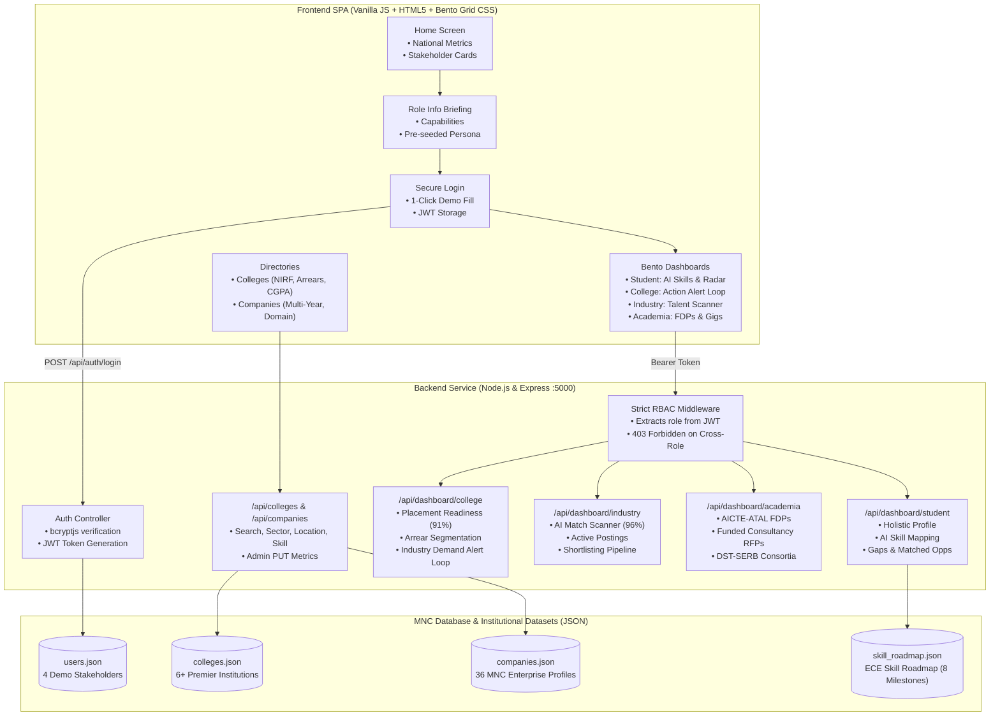

# SkillBridge – Portal for Academia–Industry Collaboration
### Problem Statement SIH26044: Skill Mapping, Internships and Placement

> **Tagline:** *"Connecting Skills. Colleges. Industry. Opportunities."*  
> **Brand Name:** **SkillBridge**

SkillBridge is a national digital ecosystem designed to bridge the gap between technical higher education and enterprise workforce demands. The platform delivers algorithmic AI skill mapping, institutional deficit analytics, automated candidate-to-internship matchmaking, and research consultancy syndication.

---

## 1. System Architecture



---

## 2. Pre-Seeded Demo Credentials

All accounts are pre-seeded with the plaintext password: `password123` (hashed with `bcryptjs` in `backend/data/users.json`).

| Stakeholder Role | Name & Title | Email Address | Password | Key Persona Focus |
| :--- | :--- | :--- | :--- | :--- |
| **Student** | Aisha Kumar (IV Year AI & DS) | `student@skillbridge.edu` | `password123` | SIH Winner, IEEE Paper, AI Skill Radar (94% Python), Docker/K8s Gaps |
| **College** | Sri Krishna College of Eng & Tech Admin | `college@skillbridge.edu` | `password123` | Placement Readiness (91%), Arrear breakdown, Industry Demand -> Action Loop |
| **Industry** | TechCorp Talent Lead | `industry@skillbridge.edu` | `password123` | AI Talent Scanner, Candidate Matching (96%), One-click shortlisting |
| **Academia** | Dr. Sharma - AI Faculty | `academia@skillbridge.edu` | `password123` | AICTE-ATAL FDPs, High-Value RFPs (₹4.5L), Joint DST-SERB Consortia |

> **Pro-Tip for Evaluators:** On the Login page (`/login`), click any **"Competition Evaluator 1-Click Fill"** button to automatically pre-fill credentials for that stakeholder.

---

## 3. Mandatory User Flow Sequence

To preserve role identity and contextual briefing, direct access to dashboards is guarded. Users must follow this exact progression:

```
[1. Home View]
      │
      ▼  (Click on Student, College, Industry, or Academia card)
[2. Stakeholder Information Preview]
      │
      ▼  (Click "Proceed to [Role] Login")
[3. Secure Login Page]
      │
      ▼  (Authenticate credentials -> Signed JWT with role claim)
[4. Authenticated Role Bento Dashboard]
```

---

## 4. Strict Role-Based Access Control (RBAC)

The backend enforces strict role-based access control. If an authenticated user with role `student` attempts to call an unauthorized endpoint, the server rejects the request with an HTTP **`403 Forbidden`** error:

```json
{
  "error": "Forbidden: Access restricted. Your role (student) is not permitted to access this college dashboard.",
  "required_role": "college",
  "current_role": "student"
}
```

The frontend also enforces role guards to prevent role switching or cross-dashboard navigation without valid credentials.

---

## 5. Stakeholder Dashboard Capabilities

### 🎓 1. Student Bento Dashboard
- **Holistic Profile:** Verified credentials across Hackathons (Smart India Hackathon 2024 Winner), Research Publications (IEEE ICACCS Scopus-indexed), NCC Air Wing Cadet "A" Grade, Inter-Collegiate Badminton Captain, and GDSC Lead.
- **AI Skill Mapping Engine:** Evaluates student proficiencies (Python: 94%, TensorFlow/PyTorch: 89%, DSA: 86%, AWS Cloud: 68%, Docker: 38% deficit, Kubernetes: 24% deficit).
- **Skill Gaps Diagnostic:** Flags critical market deficits with demand context (e.g., 84% of hirers mandate containerization).
- **Sponsored Learning Sandboxes:** AWS-sponsored micro-labs to bridge containerization deficits.
- **Matched Opportunities:** Real-time algorithmic compatibility scores (e.g., TechCorp AI Intern: 96% match).

### 🏛️ 2. College & Institutional Leadership Dashboard
- **Placement Readiness Hero:** Tracks 1,240 cohort students (91% overall readiness, 768 placed, ₹6.8 LPA average package, ₹44 LPA highest).
- **Arrear Distribution Breakdown:** Isolates 0 arrears (78% tier-1 eligible), 1-2 arrears (17% remedial coaching), and 3+ arrears (5% intensive faculty mentorship).
- **Industry Demand ➔ College Action Alert Loop:** Real-time signal loop translating recruiter deficits into immediate curriculum interventions:
  - *Alert 1:* 88% industry demand for Cloud vs. 48% cohort readiness (40% deficit) ➔ *"Deploy 3-Week AWS & Docker Boot Camp"*.
  - *Alert 2:* Cybersecurity SOC surge (+45% YoY) vs. 54% proficiency ➔ *"Host 36-hr CTF hackathon with CyberShield"*.
- **Admin-Editable Metrics:** Edit institutional training scores, no-arrear rate, and placement readiness via interactive modal.

### 💼 3. Industry & Corporate Recruiter Dashboard
- **AI Candidate Matchmaking Terminal:** Scans talent pipeline across validated skills, CGPA, research papers, and hackathons:
  - Aisha Kumar (SKCET, 96% Match for AI Intern) ➔ Shortlisted / Round 1 Scheduled.
  - Rohan Verma (PSG Tech, 91% Match for Cloud Apprentice).
  - Sneha Patel (CIT, 88% Match for Full Stack Live Project).
- **Recruitment Funnel Overview:** Tracks 5 active postings, 540 applicants, 168 AI matched, 42 shortlisted, 18 interviews.
- **Post Role Modal:** Publish new role openings directly to 18 partner colleges.

### 🔬 4. Academia & Faculty Dashboard
- **Faculty Profile:** Dr. Sharma (h-index: 18, 42 Scopus publications, 3 granted patents).
- **Faculty Development Programs (FDPs):** Sponsored AICTE-ATAL programs with Career Advancement Scheme (CAS) credits.
- **High-Value Industry Consultancy RFPs:** Sponsored corporate contracts (TechCorp ₹4.5L, CloudScale ₹6.0L, AgriTech ₹3.8L).
- **DST-SERB & Industry Consortia:** Joint calls for drone swarm navigation (₹38L outlay) and TANSEED incubation (₹15L grant).

---

## 6. Public Directories

- **Colleges Directory:** Searchable by institution name, city, district. Filterable via sliders for Min No-Arrear Rate (50% - 95%) and Min CGPA (7.0 - 9.0). Unverified colleges are explicitly tagged with `"Classification pending verification"`.
- **Opportunities Directory:** Filterable by Opportunity Type (Internships, Live Projects, Apprenticeships, Entry-Level, Incubation Clubs), Eligibility Year (I, II, III, IV Year, Graduates), Domain, and Mentorship availability.

---

## 7. Quickstart & Verification Guide

### 🚀 1-Click Launch (Windows)
Double-click [`run.bat`](file:///d:/Hackathon/SIH%2026044/skillbridge-nexus-24-main/run.bat) in the project root. It will autonomously:
1. Check and install backend dependencies if needed.
2. Start the Express backend on port `5000` in its own window.
3. Serve the frontend statically on port `3000` using `npx -y serve` to avoid `file://` CORS restrictions.
4. Automatically open `http://localhost:3000` in your default web browser.

---

### Manual Launch

#### Running the Backend Server
```bash
cd backend
npm install
node server.js
```
The server will start on `http://localhost:5000` with CORS enabled.

#### Running the Frontend Server
```bash
cd frontend
npx -y serve -l 3000
```
Open your browser to `http://localhost:3000` (or `http://localhost:5000`).

### Running Backend RBAC Verification Tests
```bash
cd backend
node test_api.js
```
This script tests:
1. Student login and JWT issuance.
2. Accessing `/api/dashboard/student` (200 OK).
3. Student attempting `/api/dashboard/college` (Blocked with 403 Forbidden).
4. Student attempting `/api/dashboard/industry` (Blocked with 403 Forbidden).
5. College, Industry, and Academia authentication and dashboard access.
6. College directory filtering and company listings.

### Launching the Frontend
Open your browser and navigate to:
```
http://localhost:5000
```
Or open `frontend/index.html` directly in any modern web browser.
